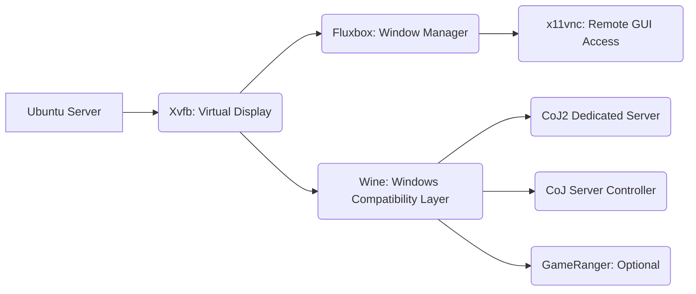

# 🎮 Call of Juarez: Bound in Blood — Dedicated Server on Ubuntu (Wine)

This repository provides a comprehensive guide and a set of scripts to host a Call of Juarez: Bound in Blood Dedicated Server on Ubuntu Linux.

We leverage the power of **Wine** for the Windows compatibility layer, along with **Fluxbox**, **Xvfb**, and **x11vnc** to create a stable, headless virtual desktop environment for the server Application.

It also includes optional scripts for **GameRanger** hosting support with automated NAT handling (SNAT).

The installation files for the Dedicated Server Tool (`CoJ_BiB_DedicatedServer_setup.exe`), GameRanger (`GameRangerSetup.exe`), and CoJ Server Controller (`setup_ModsCoJ.exe`) are provided in the `Applications` folder within this repository.

---

## 🧱 Requirements

- **Operating System:** Ubuntu 20.04 or newer (any Debian-based distribution should work).
- **Privileges:** Root or sudo access.
- **Internet Access.**
- **VNC Client:** RealVNC or any VNC viewer to access the GUI desktop.

---

## ⚙️ Step-by-Step Installation

### 1. Install Dependencies

Run this script to install all required system packages, including Wine, Xvfb, Fluxbox, and VNC utilities.

```bash
chmod +x install_dependencies.sh
./install_dependencies.sh
```

### 2. Setup Wine Environment

Initialize your Wine prefix and install essential components required by the server (DirectX, .NET, VC Redistributables, etc.).

```bash
chmod +x setup_wine.sh
./setup_wine.sh
```

### 3. Start the Virtual Desktop

Launch a stable, minimal desktop environment using Xvfb (the virtual display), x11vnc (the VNC server), and Fluxbox (the window manager).

```bash
chmod +x start_display.sh
./start_display.sh
```

### 4. Connect to Your Virtual Desktop

Use your preferred VNC client (like RealVNC Viewer) and connect to the VNC endpoint:

`vnc://<your-server-ip>:6900`

You should now see the lightweight Fluxbox desktop. All subsequent Wine Applicationss will run inside this virtual environment.

### 5. Install the Dedicated Server Tool

The installation file is available in the `Applications` folder of this repository.

Run the installer using Wine from your terminal:

```bash
DISPLAY=:99 WINEPREFIX=/root/wine-coj2 wine Applications/CoJ_BiB_DedicatedServer_setup.exe
```

### 6. Apply Server List Mod (Optional but Recommended)

To ensure your server appears correctly in the in-game server list, you need to replace the original engine_x86_ds.dll.

Replace the original DLL:

```bash
# This assumes the mod is extracted to a known location, e.g., Applicationss
MOD_PATH="Applications/DedicatedServerMod"
SERVER_PATH="/root/wine-coj2/drive_c/Program Files/Techland/Call of Juarez - Bound in Blood Dedicated Server/"

cp "$MOD_PATH/engine_x86_ds.dll" "$SERVER_PATH"
```

### 7. Install CoJ Server Controller

The installation file is available in the `Applications` folder of this repository. This Applications provides a convenient GUI for managing and launching your server.

```bash
DISPLAY=:99 WINEPREFIX=/root/wine-coj2 wine Applications/setup_ModsCoJ.exe
```

### 8. Launch and Stop Scripts

You can now start and stop your server environment using the provided scripts:

| Script                | Description                                      |
|-----------------------|--------------------------------------------------|
| launch_controller.sh | Launches the CoJ2 Server Controller GUI under Wine. |
| stop_processes.sh      | Stops all related services. |


To Launch:

```bash
chmod +x launch_controller.sh
./launch_controller.sh
```

To Stop:

```bash
chmod +x stop_processes.sh
./stop_processes.sh
```

## 🚀 GameRanger Hosting Setup (Optional)

These steps are necessary if you want to host your server through GameRanger.

### A. Install GameRanger

The installation file is available in the `Applications` folder of this repository.

```bash
DISPLAY=:99 WINEPREFIX=/root/wine-coj2 wine Applications/GameRangerSetup.exe
```

### B. Rename Server Executable

GameRanger requires the dedicated server executable to have a specific file name.

```bash
cd "/root/wine-coj2/drive_c/Program Files/Techland/Call of Juarez - Bound in Blood Dedicated Server"

# Create a copy with the name GameRanger expects
cp CoJ2Game_x86_ds.exe CoJBiBGame_x86.exe
```

⚠️ Note: Keep both files! CoJ2Game_x86_ds.exe is used by the CoJ Server Controller, and CoJBiBGame_x86.exe is used by GameRanger.

### C. Enable/Disable SNAT

To make your GameRanger-hosted server reachable, you need to toggle iptables SNAT (Source NAT) rules.

| Script            | Function                                      |
|-------------------|-----------------------------------------------|
| enable_snat.sh   | Enables SNAT rules for GameRanger visibility. Run this before hosting. |
| disable_snat.sh  | Disables the SNAT rules. Run this after hosting. |

```bash
# To enable for hosting
./enable_snat.sh

# To disable when finished
./disable_snat.sh
```

### D. Launch and Stop Scripts

You can now start and stop GameRanger using the provided scripts:

| Script                | Description                                      |
|-----------------------|--------------------------------------------------|
| launch_gameranger.sh | Launches GameRanger under Wine. |
| stop_processes.sh      | Stops all related services. |


To Launch:

```bash
chmod +x launch_gameranger.sh
./launch_gameranger.sh
```

To Stop:

```bash
chmod +x stop_processes.sh
./stop_processes.sh
```

## 📂 File and Architecture Overview

### Script Overview

| Script                        | Description                                      |
|-------------------------------|--------------------------------------------------|
| install_dependencies.sh      | Installs system packages: Wine, Fluxbox, Xvfb, x11vnc, and base tools. |
| setup_wine.sh                | Configures the Wine prefix and installs necessary components. |
| start_display.sh             | Starts the virtual display (Xvfb), Fluxbox (window manager), and x11vnc (VNC server). |
| stop_display.sh             | Stops the virtual display (Xvfb), Fluxbox (window manager), and x11vnc (VNC server). |
| enable_snat.sh / disable_snat.sh | Toggles SNAT rules for GameRanger visibility. |
| launch_controller.sh         | Launches the CoJ2 Server Controller GUI. |
| launch_gameranger.sh       | Launches GameRanger under Wine (optional utility). |
| stop_processes.sh              | Stops all related services. |

### Architecture Overview



## 🧰 Troubleshooting

### Firewall Configuration

Open the following UDP ports on your server firewall (e.g., using ufw):

| Service          | Port  | Protocol |
|------------------|-------|----------|
| Dedicated Server | 27632 | UDP     |
| GameRanger       | 16000 | UDP     |
| VNC Access       | 6900  | TCP     |

### Manually Running an Executable

Once Wine is configured, you can manually execute any Windows Application in the virtual environment:

```bash
DISPLAY=:99 WINEPREFIX=/root/wine-coj2 wine "<path-to-exe>"
```

Example (Running GameRanger manually):

```bash
DISPLAY=:99 WINEPREFIX=/root/wine-coj2 wine "/root/wine-coj2/drive_c/users/root/AppData/Roaming/GameRanger/GameRanger/GameRanger.exe"
```

## ❤️ Credits and License

This project is a community effort to preserve the classic CoJ: BiB online experience.

“Back in 2010–2016 we played freely — now we rebuild what was lost.” 🕹️

| Contributor      | Role                                      |
|------------------|-------------------------------------------|
| Roozbeh Ghazavi | Project Lead & Scripting                 |
| mx98919, Alfredo Anonym, kris[RR]  | Troubleshooting and Community Support and Script Assistance  |
| victormvy       | CoJ Server Controller Development        |


### 📜 License

This project is released under the MIT License. Feel free to modify, share, and improve this guide and its scripts.